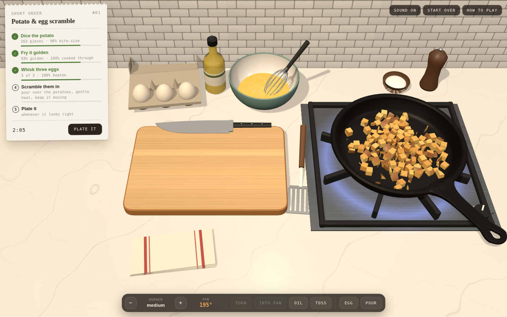
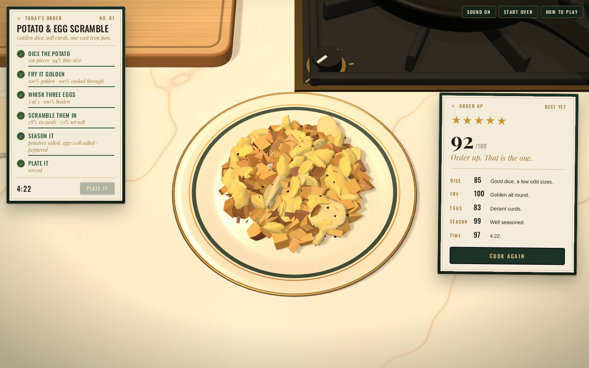
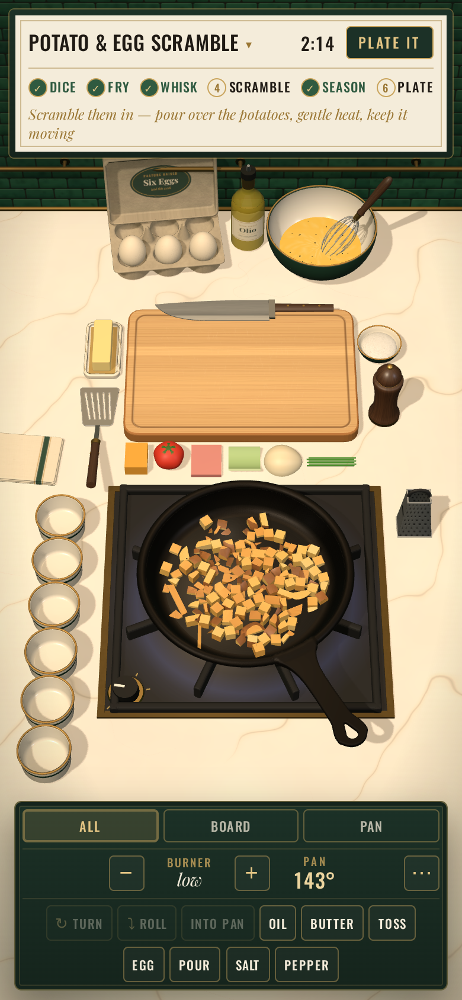
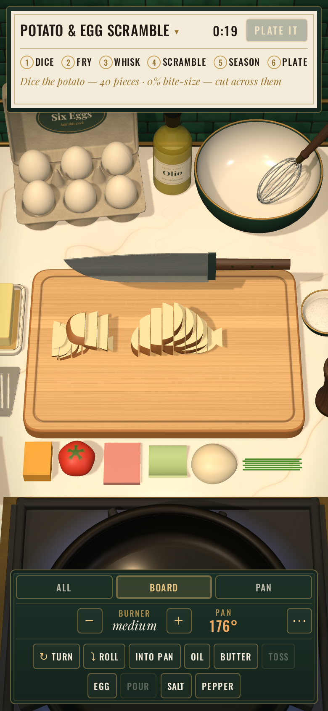

# Short Order

A cooking game in one cast iron pan. There is one ticket on the rail at a
time — pick it from the menu — and everything on the counter to make it with:
a russet on the board, a chef's knife, a carton of eggs, a bowl and a whisk, a
bottle of oil, a stick of butter, salt and a pepper mill, six extras lying
whole on the counter for the knife, and the pan on a gas burner that starts
cold.

| | |
|---|---|
| **Potato & egg scramble** | Dice the potato, fry it golden, beat three eggs and scramble them in. |
| **Scrambled eggs** | Three eggs, beaten smooth, stirred slowly in butter into soft curds. |
| **Sunny side up** | Two eggs broken straight into the pan and left alone: whites set, yolks runny. |
| **Over easy** | The same, turned over once — briefly, so the yolks still run. |
| **French omelette** | Stirred while it runs, left to settle, rolled: pale, soft inside, no colour. |
| **Diner omelette** | Set flat, filled — cheese and one more at least — and folded in half. |
| **Freestyle** | No ticket. Anything on the counter, any way you like, marked on what it turns out to be. |

Season it and plate it. The plate is marked on what is actually on it.



<p>
  
  
  
</p>

## Run

```sh
npm install
npm run dev       # → http://localhost:5173
```

It is a static page and nothing else — no server, no keys, no network. `npm run
build` puts it in `dist/`, and the Pages workflow publishes that on every push
to `main` once Pages is switched on (Settings → Pages → Source: GitHub Actions).
It deploys to Vercel as it is, too ([`vercel.json`](vercel.json) pins the
build), with a preview for every branch.

## Playing

| | |
|---|---|
| **knife** | Over the board the knife follows the pointer. Click to chop where the blade is — it goes through whatever is under it. |
| **roll** | `T`, shift-right-click, or **⤵ roll**, tips one thing onto its side — the one under the pointer, or the biggest — so the knife, which only cuts straight down, can go through it the third way. A tomato goes on the board on its side already, its top toward you: slice it off and it goes in the bin. |
| **turn** | Right-click the board, or `R`, turns the pile a quarter turn so the next cuts go the other way. On a phone, twist two fingers on the kitchen, or tap **↻ turn** — it lights up when the ticket says to turn. |
| **carry** | Drag something on the board and every bit of it comes up on the flat of the knife — just the onion, say, leaving the potato; drag from between things for the whole pile. Let go over the pan to drop it in, over one of the six empty ramekins along the front of the counter to keep it there until a click tips it into the pan — one thing to a ramekin, heaped up and spilling over the rim if there is a lot of it — over the counter where the extras lie to be rid of it (whole, it goes back; cut, in the bin), anywhere else and it goes back just as it was. `S` scrapes the whole board straight in. |
| **burner** | Click the knob to turn it up, right-click to turn it down — or `Q` and `E`. The pan's temperature is in the bar. |
| **oil** | Click the bottle, or `O`. |
| **butter** | Click the butter for a pat into the pan, or `B`. |
| **salt, pepper** | Click the salt for a pinch (`A`), the mill for a twist (`F`): over the food in the pan, or into the eggs in the bowl if the pan is empty. Drag either to the bowl or the pan to choose. |
| **spatula** | Over the pan, drag to stir and click to flip what is under it. `space` tosses the whole pan. |
| **handle** | Drag the pan's handle to shake it — the food slides — and flick upward as you let go to toss. |
| **eggs** | Click the carton to break an egg into the bowl (`G`). Drag round and round in the bowl to whisk. `P` pours. For fried eggs the carton breaks them straight into the pan instead. Freestyle, drag an egg from the carton to the pan — or `H`, or **egg → pan** — to fry it. |
| **turn an egg** | Click a fried egg to slide the spatula under it and turn it over; `space` turns them all. Not before the white has set enough to hold. A spatula dragged through a yolk breaks it. |
| **look** | **all · board · pan** over the bar, or `V`, closes the camera in on the board or the pan, or stands it back to see the whole counter. With a mouse, roll the wheel forward over the board or the pan to close in on it and back to stand back; on a phone, spread two fingers over one, and pinch. Pick something up while closed in and the camera stands back while it is carried, so the pan and the ramekins are in reach, and goes back after. |
| **order** | The dish's name on the ticket, or **change order** in the menu, for another dish. |
| **fold** | `L`, or the bar's **fold**, folds the sheet of egg: rolled for a French omelette, in half for a diner one. Whatever is lying on the egg goes inside. Before that, **flip** (or a click on it) turns the whole omelette over once it has set. |
| **extras** | Click one on the counter — cheese, tomato, ham, green pepper, onion, chives, or `1` to `6` — and it goes onto the board: a block of cheddar, a tomato, a slice of ham, a quarter of a pepper, half an onion, a bunch of chives. Cut it small and scrape it in — or drag the cheese, or a potato, to the box grater and it is shredded onto the board — a potato into long strands for hash browns; cheese over the side with the one wide slot is sliced instead. Onto the egg before folding is a filling; over the food after is a topping. |
| **plate** | The button on the ticket, or `enter`, whenever it looks right. |

Everything in that list is also a button in the bar along the bottom, so it all
works on a phone: a tap on the board chops, a drag carries or stirs or whisks, upright or
on its side. Upright, the ticket is a strip across the top and the bar wraps
into rows along the bottom; on its side, the two stand one over the other in a
rail down the left and the kitchen has the rest of the screen. Either way,
**board** and **pan** close in on the one being worked, big enough to aim a
cut with a fingertip.
And it all works from the keys: `↑` `↓` aim the knife along the pile and `C`
chops, `S` scrapes, holding `W` whisks and holding `X` stirs, `G` cracks an egg
(`H` into the pan, freestyle), `L` folds, `T` rolls, `1`–`6` the extras, `B` butters, `A` salts, `F` peppers, `V` looks, `enter`
plates, `M` mutes.

### What it takes

A potato goes to dice in three passes. Cut it into rounds; they are too tall to
stand on their cut faces and fall over flat, shingled on each other. Cut across
the rounds into strips. Turn the pile and cut across the strips. The knife does
not know any of that — it only ever makes one flat cut — so how even the dice
come out is how evenly you cut.

In the pan a piece browns hardest on the face that is down; the faces
standing up from it sit in the oil and colour slowly, and the top hardly at
all. Leave it and it is dark underneath and pale on top; toss it, or stir it,
and it comes down on another. Small pieces cook through in half a minute; a whole
potato never does. Wet potato on iron that is not hot yet steams instead of
browning, and a pan full of it pulls the iron's temperature down until the
water is gone. Oil first. Too hot and the faces that stay down burn.

Eggs poured into the pan run out across the floor, and set from the bottom up.
Drag the spatula through egg that has started to set and it comes away in
curds — slow strokes make big soft ones — and those cook on like any other
piece. Leave it alone and it sets flat, which is an omelette. Egg wants less
heat than potato: turn the burner down before it goes in.

An egg broken in whole keeps its yolk apart: a dome sitting on its white,
cooked only from below, through the white, so it stays runny for minutes while
the white sets — slowest close round the yolk, where the white is deepest and
the top never touches iron. Thick white holds together round its yolk instead
of running across the pan. Turned over, the yolk is on the iron and sets five
times as fast: over easy is a turn, a moment, and off.

Folded, the sheet of egg is one piece from then on and cooks on like any
other — a French omelette wants rolling while the top is still wet, so it is
just set inside, and wants no colour at all; a diner omelette is set through
and may be golden.

The extras are real food too, and come whole: they go on the board beside
the potato and are cut the same way — slices, across them, turn, across
again — and the knife goes through whatever is under it, so leave room
between them. Scraped in whole, or only sliced, they are marked down: a bite
is no side longer than a mouthful. Onion and green pepper want a minute in the
pan before the eggs go over them; ham crisps; cheese slumps and melts. Each
one goes on whatever dish you like, and is marked for how well it suits it —
chives on a French omelette, yes; ham, an eyebrow — and for how much went in:
one of each is a portion, four tomatoes is a lot of tomato.

Freestyle has no ticket and starts with a bare board. Everything is on the
counter — a potato to take or leave, the eggs for the bowl or straight into
the pan, all six extras — and the plate is
marked on what it turns out to be: potato on its dice and its fry, eggs as
whatever they became — curds, fried, folded or set flat — the extras and the
seasoning, each weighed by how much of the plate it is. One egg is as right
as three, and there is no clock.

Butter greases the pan like oil, and eggs scrambled in it come out richer for
it. It melts in seconds on hot iron and foams while its water cooks off; then
its milk solids brown, nutty, and on a hot pan go on to burn, which makes the
whole plate bitter. Melt it on gentle heat, or let the eggs cover it.

Salt and pepper go onto whatever they are sprinkled over, each piece taking its
share, and stay there — salt the potatoes as they fry and the eggs that go in
later are not salted. Season the eggs in the bowl, or the scramble in the pan.
About a pinch for the potato and one for the eggs is right; pepper is more
forgiving than salt.

The ticket keeps a running commentary on all of this, read off the food rather
than ticked by hand — down to what the knife should do next, from the shapes
lying on the board — and a note pops up over the bar when the pan needs you:
something catching, a dry pan, a cold one, or eggs going into one too hot for
them. The plate is marked on the same measurements: how much
of the potato is a good bite and how even, how much of it is golden and cooked
through against pale, burnt or raw, whether the eggs were beaten smooth,
scrambled rather than set flat, and soft rather than runny, rubbery or brown,
whether the potatoes and the eggs are each seasoned right — and how long the
ticket waited. The other dishes are marked their own way — fried eggs on their
whites and yolks, omelettes on their texture, their colour and, for the diner
one, their filling — and each against its own time.

## How it works

See [design](docs/design.md) for the long version. In short:

- **The knife cuts the mesh.** Every piece of food is a closed triangle mesh.
  A chop is a plane through every piece under the blade: triangles are sorted
  to either side, the ones it crosses are split, and the hole it leaves in each
  half is found from the half's own open edges and filled with flesh. Both
  halves are closed solids again, so they can be cut again, measured, and
  browned — and their flat faces are refilled with as few triangles as they
  need, so a diced potato stays light.
  [`src/geometry/slice.js`](src/geometry/slice.js),
  [`src/geometry/simplify.js`](src/geometry/simplify.js)
- **Browning lives on six sides.** Each piece keeps how browned each of the six
  directions of its own frame is. Whichever is down in the pan takes the heat;
  every vertex is painted from the six by the way it faces.
  [`src/sim/pan.js`](src/sim/pan.js), [`src/view/pieces.js`](src/view/pieces.js)
- **Egg is a sheet until it is not.** Liquid egg is a heightfield over the
  pan's floor that runs, sets and browns per patch; the spatula tears set egg
  off it into curds, which become pieces. [`src/sim/eggs.js`](src/sim/eggs.js)
- **Yolks are kept apart.** An egg broken in whole is its white in the sheet
  and its yolk on its own, which a spatula can break and a turn puts face
  down; a fold lifts the whole sheet off as one omelette.
  [`src/sim/eggs.js`](src/sim/eggs.js)
- **The menu is data.** Every dish is its steps, how each is read off the
  food, and how its plate is marked. [`src/game/dishes.js`](src/game/dishes.js),
  [`src/game/grade.js`](src/game/grade.js)
- **Seasoning sticks where it lands.** A pinch is shared over the pieces in the
  pan by how much floor each covers, and over the egg lying there; curds torn
  from the egg take their share of it. The plate is tasted part by part.
  [`src/sim/season.js`](src/sim/season.js)
- **Sound is synthesised.** The sizzle is filtered noise and a crackle of tiny
  pops, both following how much wet food is on hot iron.
  [`src/audio/sound.js`](src/audio/sound.js)

The renderer, the pan and both ingredients come from
[debater](https://github.com/h1ddenpr0cess20/debater): its WebGPU / WebGL 2
renderer is in [`src/vendor/gfx`](src/vendor/gfx) (with the three.js licence it
is partly ported under), the cast iron skillet is the one the debate was held
in, the potato is Tater's russet surface with his face taken off, and every
egg is Marc's shell.

| Script | |
|---|---|
| `npm run dev` | Vite, with hot reload |
| `npm run build` | Bundles the game to `dist/` |
| `npm run preview` | `build`, then serve `dist/` |
| `npm test` | `node:test` over the slicer, the simulations and the marking |
| `npm run lint` | ESLint |

`?renderer=webgl` in the address forces the WebGL 2 backend where WebGPU would
otherwise be used.
